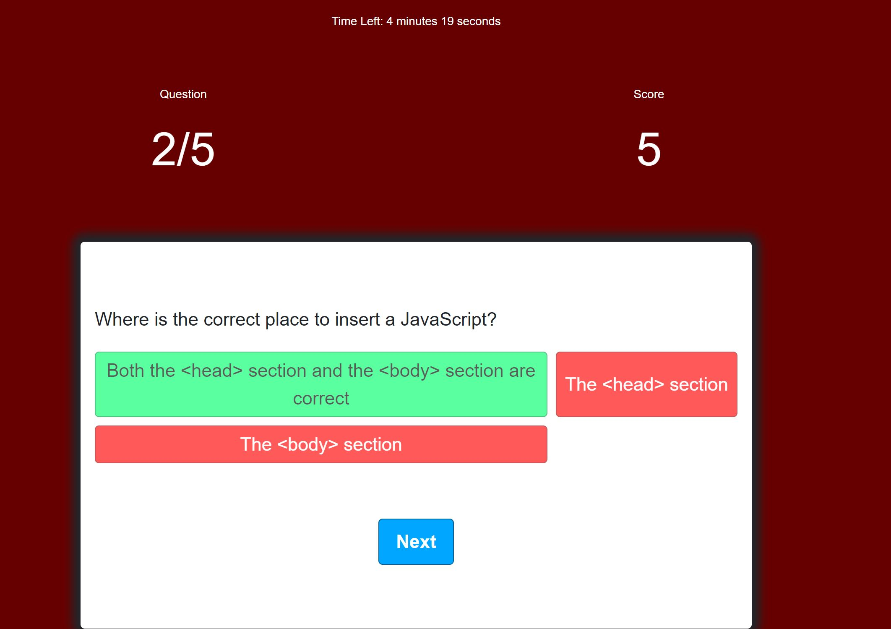

# Assignment_4 Code Quiz

This code quiz is build using HTML,CSS and Javascript.

Function of this quiz:

1. When the answer is correct you will score 10 points
2. When the answer is wrong your points will be decrease by 5.
3. Score can be saved in the leaderboard.
4. Highest score can be viewed.

Deployed application link: https://prakritirajbhandari.github.io/Assignment_4/.

Screenshot:

